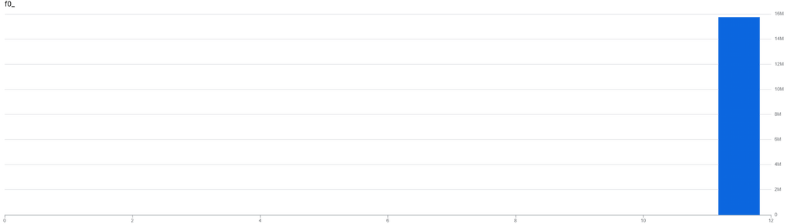

In 2021, BigQuery announced a new [`TABLESAMPLE` operator](https://docs.cloud.google.com/bigquery/docs/table-sampling)
which can be used to read a subset of your data to reduce query costs when your
query doesn't need all the data. The documentation describes the feature as a
way to "query random subsets of data" but depending on how your table is
configured, this method can be dangerously misleading.

BigQuery tables can be [partitioned](https://docs.cloud.google.com/bigquery/docs/partitioned-tables)
and [clustered](https://docs.cloud.google.com/bigquery/docs/clustered-tables).
Partitions divide your data into integer-based or date-based blocks colocating
in storage with the same values. Clustering further sorts the rows within those
partitions by the specified columns. Partitioning and clustering can be used to
significantly optimize query performance by reducing how much data is processed
when the queries filter on those columns. Keep in mind that the BigQuery bytes
estimate for a query takes into account partitioning but not always clustering.

Table sampling works by selecting a subset of the data blocks necessary for a
given query. So a table sample of 50 percent will roughly read half of the data
blocks, assuming the table is sufficiently large and has many data blocks.

## Examples

Let's look at some examples of queries that use all three techniques using the
[`pageview_2025` table](https://console.cloud.google.com/bigquery?ws=!1m5!1m4!4m3!1sbigquery-public-data!2swikipedia!3spageviews_2025)
of the public wikipedia dataset.

The first query simply counts how many rows are in the table but this requires
reading over 800GB of data. That's pretty inefficient and in fact, this table is
configured with a required partition filter, so you can't even run this query. If
you could, it would return 158,583,259,826 views.

```sql
SELECT SUM(views)
FROM `bigquery-public-data.wikipedia.pageviews_2025`
```

Let's reduce the number of partitions by including a WHERE clause on the
`datehour` column to limit the rows to only those in October and switch to getting
the total pageviews. This query reads only 72GB of data, processing 4,876,284,775
rows for a total of 14,445,367,832 views.

```sql
...
WHERE TIMESTAMP_TRUNC(datehour, DAY) >= "2025-10-01"
  AND TIMESTAMP_TRUNC(datehour, DAY) < "2025-11-01"
```

This table is also clustered by the `wiki` (subdomain) and `title` columns to
allow for efficient pageview counts by page and domain. If we also filter on
`wiki` (one of the clustering columns) in our query we will further reduce the
data that's read. This query only reads 6GB of data and it returns 267,013,325.

```sql
...
  AND wiki = 'de'
```

We could sample on a per-row basis using `RAND()` and BigQuery would have to
read all of the data. We just determined that was 6GB and this query returns
26,494,288 (your results may vary).

```sql
...
  AND RAND() < 0.1
```

In contrast, if we use `TABLESAMPLE` to add sampling of 10 percent, full query
shown below, BigQuery will roughly read a tenth of the data blocks. The following
query reads only 544MB of data.

```sql
SELECT SUM(views)
FROM `bigquery-public-data.wikipedia.pageviews_2025`
TABLESAMPLE SYSTEM (10 PERCENT)
WHERE TIMESTAMP_TRUNC(datehour, DAY) >= TIMESTAMP("2025-10-01")
  AND TIMESTAMP_TRUNC(datehour, DAY) < TIMESTAMP("2025-11-01")
  AND wiki = 'de'
```

Let's run that query 10 times:

| SUM(views) |
| ---: |
| 13070664 |
| 26763419 |
| 11474972 |
| 10293222 |
| 14133034 |
| 11399557 |
|  9144304 |
| 13571541 |
| 18521447 |
| 30895814 |

Notice the massive variance, ranging from 9 million to over 30 million views. The
total views was 267 million so we would've expected around 26 million as a result
and we only got close to that result twice.

## Sampling Bias

The pageview data for October contains 1,980 distinct `wiki` values and
238,667,980 distinct `title` values. Remember that clustering sorts similar rows
together in data blocks and table sampling will limit the query to a subset of
those blocks. As we just saw, this can lead to sampling bias if the features are
used together for a query. The last query looks at only a tenth of the blocks and
depending on which titles and which times are included in those blocks you get
vastly different answers.

For a given hour in October for the `de` wiki gets between approximately 52,000
views and 897,000 views with the following distribution:


However the distribution of views by title is heavily skewed towards the
[homepage](https://de.wikipedia.org/wiki/Wikipedia:Hauptseite),
which received 15,755,415 pageviews. The 90th percentile was a mere 48 pageviews.



Because table sampling works at the block-level, the results are a lottery. If
your sample happens to include some homepage blocks, you'll get a large
number otherwise it'll be far too low.

I'm glad to see that Google finally acknowledges this and added a section outlining
how it performs on [partitioned and clustered tables](https://cloud.google.com/bigquery/docs/table-sampling#partitioned_and_clustered_tables)
to the documentation. However, it should be much more prominent or the feature
should consider being removed completely. If you're considering table sampling
you probably have a large table and if you have a large table you should be using
partitions and/or clustering.

The bias is most extreme when you have clustered data that is not evenly
distributed or when you're using a small sample size. You can stick to using
`RAND()` your data isn't suitable for `TABLESAMPLE`, especially for one-off
queries. But if you have a constant need for sampled data your archicture allows
for it, instead sample the data outside of BigQuery and write to a separate
"sample" table during insertion.

_Note: BigQuery does not support the `BERNOULLI` sampling method._
