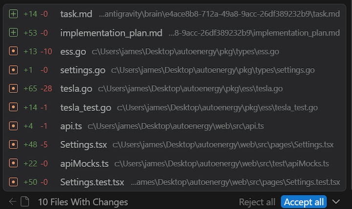
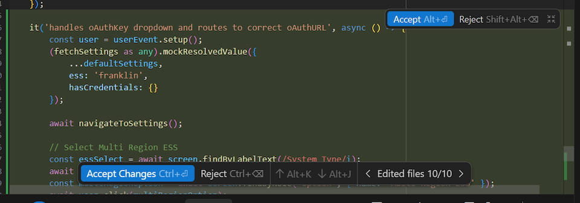
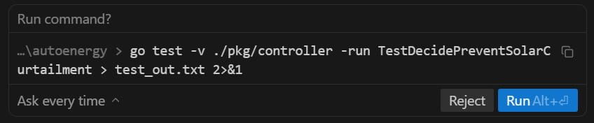

[Antigravity](https://antigravity.google/) is a new VSCode fork from Google
designed to prioritize AI-assisted development. It came out in November and
I've been using it since on personal and professional projects. Day-to-day, I'm
consistently having AI write tests or smaller, well-scoped features. I've been
using a mix of planning and fast mode but I prefer planning mode for anything
more than a few lines of code so I can critique the plan before the AI starts
generating code.

## Planning Mode

Planning mode starts with the agent generating an "Implementation Plan" and
asking for approval before proceeding. You can comment on the plan and have AI
iterate on it until you're ready to proceed. The Antigravity interface for
reviewing the plan is great and being able to comment on individual plan items
works well for making minor changes to the overall plan. The produced plan
follows a general structure of "Proposed Changes", broken down into "Structure"
and "Components", and then "Verification Plan", broken down into "Automated Tests"
and "Manual Verification". I prefer to see the updated plan after leaving
comments but sometimes AI feels confident enough to proceed without showing me
the updated plan. I've found Claude and Gemini 3 Flash to be more eager to
proceed compared to Gemini 3/3.1 Pro.

Typically my comments are bike-shedding about names of functions or files but
occasionally I'll have more substantial comments about the implementation of an
API or database schema. This is especially true when decisions require context
about the larger vision of the project or future features that could be added.

## Review

As the agent completes its tasks, it starts to show a list of "artifacts" which
are files in the repo that were changed thus far. The artifacts list is shared
between agents so it can be confusing at times why certain files are showing up.
However, it's helpful to see what's being changed and you can start to
review the changes per-file. There's also an "Accept All" button if you are
comfortable with all of the changes and don't need to review each one.

Once the agent has completed all the tasks it generates a "Walkthrough" that
explains all the changes it made. I rarely find this useful and instead start to
just review the files changed. Each file changed is shown in the agent window and
you can click through to see the diff right in the editor. You can accept or
reject chunks of changes, all changes in the file, or all changes in the project.
This is the best interface I've used for reviewing changes and I prefer being
able to review them immediately right in the editor compared to pushing and
reviewing in the PR.

## Models

Despite paying for Google's AI Pro plan ($20/mo) I regularly hit the Gemini 3.1
Pro rate limit and that used to just mean a 5 hour cooldown. I'd go to bed and
in the morning have a fresh slate. However, as of a few weeks ago the Pro models
have a 7 day cooldown. As a result, I rarely end up using the Pro models except
for very specific difficult features or for planning. I've tried Sonnet 4.6 and
Opus 4.6 numerous times but haven't seen a significant improvement. However,
they've proven useful for reviews and double-checking the work of myself or
another model.

Gemini 3 Flash is now my go-to model for most tasks. It's fast and does a good
job at simple Go and React coding. I have to usually critique its changes but
overall it's still much faster than writing all of the code myself. Tests are
the area I want to use it the most but I've found it to do a poor job at writing
comprehensive tests that include several assertions. For example, it loves to use
`mock.Anything` for all of the arguments in mocks rather than specifically
asserting the significant values. I haven't yet found a way to consistently get
it to write comprehensive tests in the format I expect. It also struggles with
debugging failing tests and sometimes alters code to fix a failing test rather
than correcting the test.

## Commands

The agent can run commands to lint files, execute tests, install dependencies,
and more. The agent by default requests review before every command but you can
configure it to always proceed with any command (YOLO-style). Since reviewing
every command can be tedious there's an allow list and a deny list, which
theoretically should cover the majority of commands. My allow list contains things
like `go test`, `npm run test`, `npm run build`, `ls`, `grep` and these are
supposed to match command prefixes but I've found it to only work half the time.
For example, the agent asked to run the following command even though `go test`
is in my allow list. I haven't figured out exactly why but I think it has to do
with it redirecting the output. Commands that contain a pipe `|` trigger it as
well even if it's in a string.

## Autocomplete

The autocomplete in Antigravity generally predicts up to a few lines ahead and
will not autocomplete whole functions or blocks of code in one tab. Cursor's
autocomplete was way too eager and I would often accidentally accept autocomplete
changes when indenting code. The biggest benefit I get from autocomplete are making
several similar consecutive changes like adding an argument to a method or
refactoring a common line of code. It's convenient to be able to tab though the
file tweaking each spot.

I use the Go LSP server and commonly find Antigravity's autocomplete competing
and less useful than the native Go extension's autocomplete when I'm trying to
call a method, access a field, or start a callback signature. Go has the advantage
of knowing the names of things that don't exist in the current file or even the
repo. This was frustrating even when I was using Cursor so I don't expect it to
be easy to solve.

## Multiple Agents

Antigravity supports concurrent agents within or across repositories. The agent
manager window gives you an overview of all active chats across repositories. Given
how closely I monitor and review the agent's work, I haven't found myself
orchestrating multiple agents across repositories yet. I seldom have concurrent chats
going on within a project because they tend to step on each other's toes especially
when debugging tests. If I can ensure a clear separation of work, like different
packages or folders, then it has come in handy. As the agents improve and they
can operate independently for longer, I see myself utilizing this feature more.

# Final Verdict

Overall I've been more productive using Antigravity compared to without it
despite some of the frustrations I shared. It's only been out for a few months
and during that time I haven't seen it change much outside of the availability of
the models. I'm looking forward to Google addressing some of the issues.
