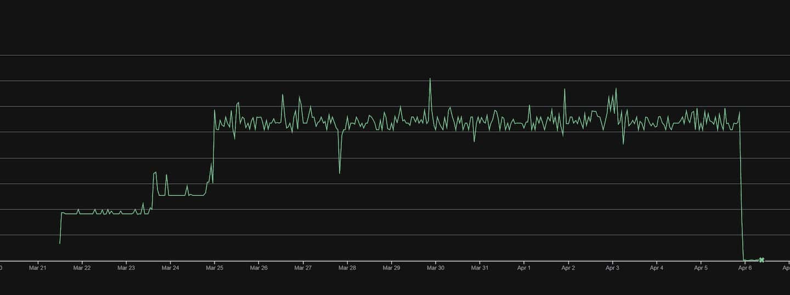

I've been using Firestore for [RateRudder](https://raterudder.com/) because it is
simple, free, hosted for me, and supports subcollections. The subcollections are
extremely useful in a multi-tenancy schema because every tenant can have their own
set of collections under their namespace. [Firestore pricing](https://cloud.google.com/firestore/pricing?utm_campaign=DEVECO_GDEMembers&utm_source=deveco)
is based on how many documents you read, write, or delete. The free tier includes
50,000 reads, 20,000 writes, and 20,000 deletes per day. The pricing for Writes
and deletes are straightforward, but reads are complicated.

You're charged at least 1 read for every document scanned in order to fulfill a
query, with a minimum of 1 per query. Additionally, you're charged 1 read for every
1000 index entries except for [specific single-field index queries](https://cloud.google.com/firestore/pricing?utm_campaign=DEVECO_GDEMembers&utm_source=deveco#:~:text=nuances%20in%20detail.-,Index%20entry%20reads,-You%20are%20charged).
You're also charged for non-document queries, like listing collection IDs.

If Firestore happens to be down the Go client will hang waiting for the
connection to succeed, or until the context is cancelled. I set up a Cloud Run
health check to ensure that a Firestore connection is established and Firestore
is responding to queries. That way if there is an issue, Cloud Run can restart
my container, or at least not serve any requests. The [firestore Go package](https://pkg.go.dev/cloud.google.com/go/firestore)
doesn't expose any health-related methods and ideally I needed one that didn't
cost me any reads. I assumed that listing collections would only cost a single
read which seemed like it was cheap enough. My health check function was simply:

```go
func (f *FirestoreProvider) Ping(ctx context.Context) error {
	if f.client == nil {
		return fmt.Errorf("firestore client not initialized")
	}
	_, err := f.client.Collections(ctx).Next()
	if !errors.Is(err, iterator.Done) && err != nil {
		return fmt.Errorf("failed to ping firestore: %w", err)
	}
	return nil
}
```

## Read Overages

A few weeks later, I was surprised when I started being billed for document
reads since I should've been well under the 50,000/day limit. I pull up the
Usage Insights page which groups your read operations by collection or collection
group but there weren't any collections with more than a couple thousand reads.
Next I checked the Query Insights and at the top of the list was
`COLLECTION * SELECT __collection__`. I assumed this was the underlying query
behind listing collections but it wasn't clear why it was costing 7 read
operations per execution instead of a single operation. Furthermore, I only
had 4 top-level collections being returned.

| Query | Read Operations | Executions |
| ----- | --------------- | ---------- |
| `COLLECTION * SELECT __collection__` | 62,496 | 8,928 |

I [switched out the code](https://github.com/raterudder/raterudder/commit/afe643d8c5a81fdc9f1f6339b417a3eed6bb192a)
with a query for a non-existent document. Queries are billed a minimum of 1 read
even if a document isn't returned, but even if this document were to exist, it
should only cost a single read.

```go
func (f *FirestoreProvider) Ping(ctx context.Context) error {
	if f.client == nil {
		return fmt.Errorf("firestore client not initialized")
	}
	_, err := f.client.Doc("health_check/non_existent").Get(ctx)
	if err != nil && status.Code(err) != codes.NotFound {
		return fmt.Errorf("failed to ping firestore: %w", err)
	}
	return nil
}
```

You can see the immediate drop in read operations on April 5th confirming that
listing collections was the cause of the excess.



## Investigation

Now my reads are under 20,000/day and I'm back within the free tier but I
was concerned there was some underlying bug that was causing the excess
operations. The [Firestore pricing page](https://cloud.google.com/firestore/pricing?utm_campaign=DEVECO_GDEMembers&utm_source=deveco#:~:text=offsets%20whenever%20possible.-,Queries%20other%20than%20document%20reads,-For%20queries%20other)
says:

> For queries other than document reads, such as a request for a list of
collection IDs, you are billed for one document read. If fetching the complete
set of results requires more than one request (for example, if you are using
pagination), you are billed once per request.

Maybe the Go client was making a request per collection? I added a gRPC
intercepter to log whenever a gRPC request is made:

```go
client, err := firestore.NewClient(ctx, projectID,
  option.WithGRPCDialOption(grpc.WithUnaryInterceptor(
    func(
      ctx context.Context,
      method string,
      req, reply interface{},
      cc *grpc.ClientConn,
      invoker grpc.UnaryInvoker,
      opts ...grpc.CallOption,
    ) error {
      log.Printf("gRPC call: %s", method)
      return invoker(ctx, method, req, reply, cc, opts...)
    }),
  ),
)
```

This confirmed that the Go client is only making a single gRPC call when calling
`Collections(ctx).Next()`. At this point, I was stumped so I created an empty
GCP project, reproduced the issue, confirmed I was billed more than expected on
the Usage page, and [filed a bug](https://github.com/googleapis/google-cloud-go/issues/14444).

I'll update the post when I hear back from Google.
